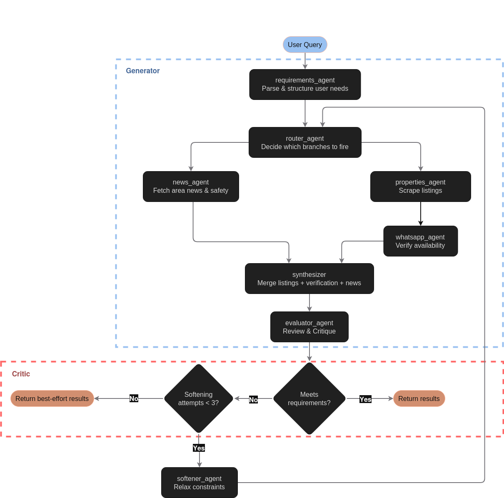

<p align="center">
  
</p>

# Estatia

Autonomous multi-agent system for real estate acquisition. Agents search listings across multiple sources, verify availability, evaluate properties against user requirements, and iteratively refine results — all without human intervention.

A user describes what they're looking for (location, budget, size, type). Estatia structures those requirements, fans out to specialized agents that run concurrently, and returns a curated, ranked shortlist. If no results meet the criteria, the system autonomously relaxes constraints and retries up to three times before returning a best-effort result.

> [!IMPORTANT]
> Estatia is currently in **early development**. APIs, prompts, and agent orchestration flows may change frequently.
> We do not recommend inputting sensitive credentials directly into LLMs or AI agents (any unknown software, really).

## Architecture

This repo contains multiple building blocks that power Estatia.

<p align="center">
  
</p>

## Agents

| Agent | Responsibility |
|---|---|
| `requirements_agent` | Parses user input into a structured requirements object; loops for clarification if needed |
| `router_agent` | Determines which branches to activate based on requirements; stateless and deterministic |
| `properties_agent` | Scrapes real estate listing sites (Finca Raíz, Metrocuadrado, etc.) for matching properties |
| `news_agent` | Fetches area news relevant to the search zone (security, infrastructure, market trends) |
| `whatsapp_agent` | Contacts listed phone numbers to verify each property is still available |
| `synthesizer` | Merges and deduplicates outputs from the parallel agents into a unified candidate set |
| `evaluator_agent` | Scores candidates against requirements; decides pass, retry, or give up |
| `softener_agent` | Relaxes requirement constraints incrementally when evaluation fails; increments retry counter |


## Quick start 🚀 

```bash
# Install dependencies
uv sync

# Configure environment
cp .env.example .env
# Edit .env with your API keys

# Run
uv run src.main
```